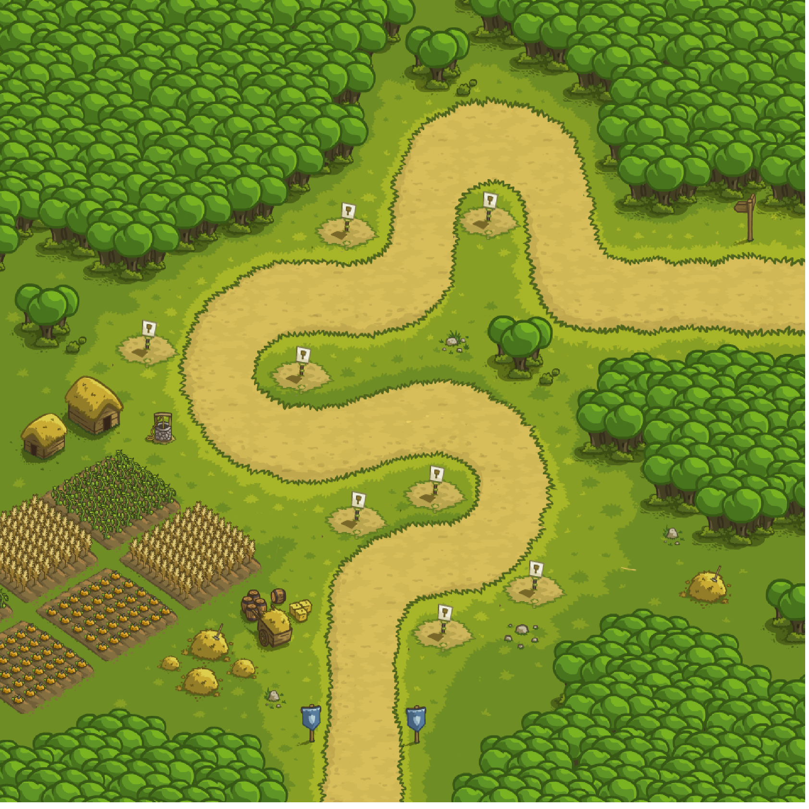
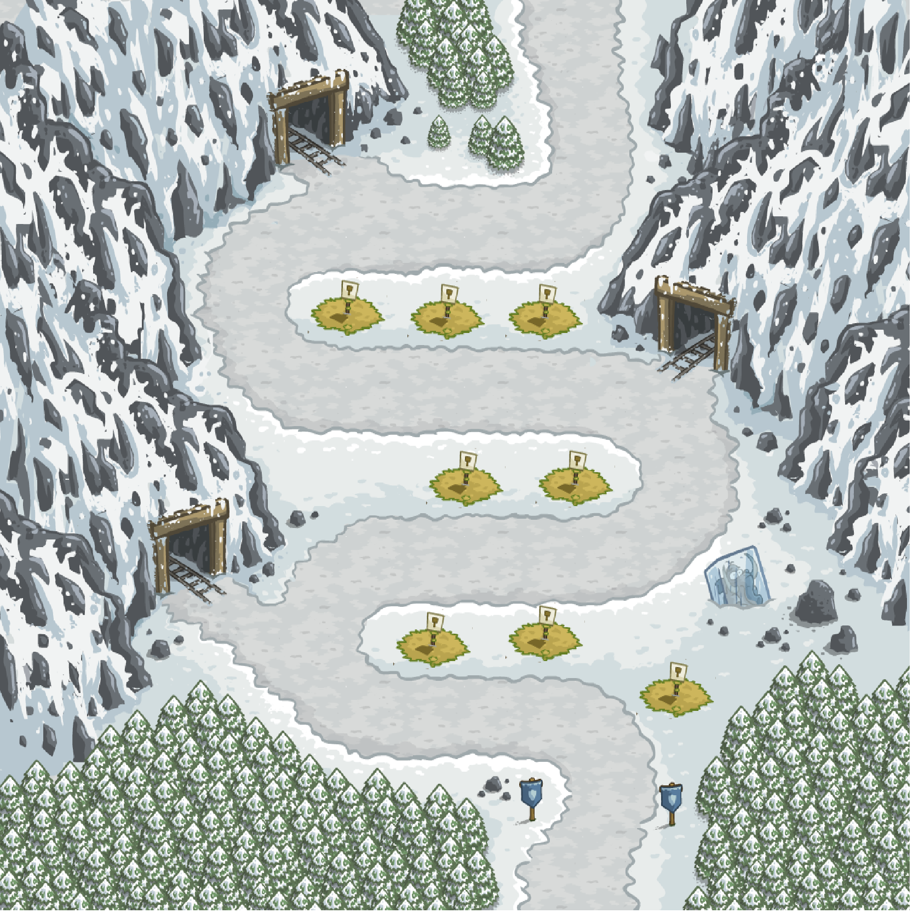

# Kingdom-Rush-Game
## A C++ implementation of mobile game, **Kingdom Rush** using RSDL.

The main goal of this project is getting familiar with **Top-Down Design** and employing graphical libraries for developing a game using C++ language.

This mini version of Kingdom Rush has two levels and many enemies and towers. You can see the level maps bellow. 

### Level 1

### Level 2

## Run
In order to run this game you need to execute make. After the executable file (test.out) is created run it with the name of the file containing the enemy wave information. The afformentioned files are in the a.txt and b.txt for level 1 and level 2 respectively.

## RSDL
In this project I have used RSDL graphical library which is a wrapper for SDL 2

See [Wiki](../../wiki) for [Documentation](../../wiki/Documentation) and [Installation Guide](../../wiki/Installation).
